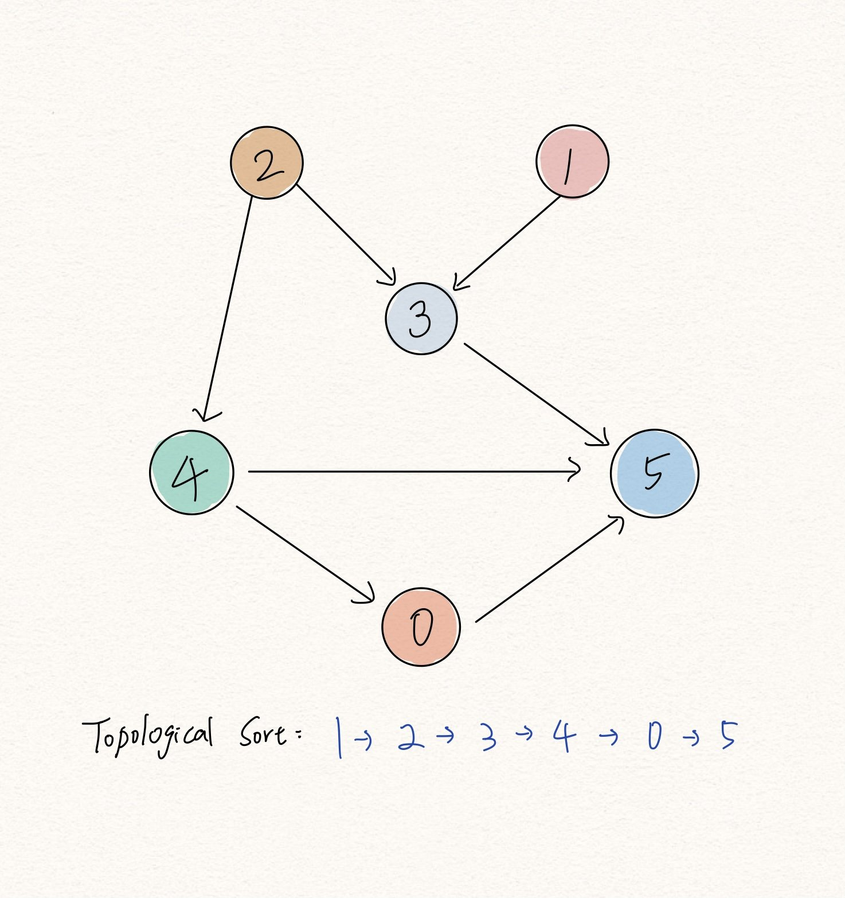

# Graph

## Why Graph?
### 找最短路徑
> 在 Graph 中的兩頂點間找最小合計權重的演算法。 
- 可用來解決
    1. 伺服器溝通時間最短的路徑（組合）
    2. 鐵路路線中移動時間最短路徑
    3. 鐵路路線中票價最便宜的路徑
    4. …
###  圖形搜尋演算法
> 沿著 邊 搜尋 頂點 直到 目標頂點 的演算法    
- 根據搜尋順序，分成 BFS & DFS
Search Steps
1. 從某個頂點（起點）出發
2. 經由邊搜尋頂點
3. 找到目標頂點（終點）

## Algo

### 廣度優先搜尋 BFS (Breadth-first Search)
### 深度優先搜尋 DFS (Depth-first Search）

---

## Directed Acyclic Graph (DAG) aka 無環有向圖
有些事件具有絕對的「先後關係」

1. 資料之間存在先後關係（例如：元素 A 一定要先於元素 B），要排出所有資料的線性排序。 
2. 找出有向圖 (dirceted graph) 中是否存在 cycle 。

課程擋修規則、族譜、水系、閃電、洗澡

### Algo: Topological Sort/Ordering
在無環有向圖( Directed Acyclic graph ) 中找出頂點間的線性排序 (linear ordering)
若圖中存在一條邊由頂點 u 指到頂點 v ，則 topological sort 出來的線性排序， u 必定在 v 之前。

https://haogroot.com/2020/12/13/topological-sort-leetcode/

## [Adjacency List](https://www.programiz.com/dsa/graph-adjacency-list)
An adjacency list represents a graph as an array of linked lists.

The index of the array represents a vertex and each element in its linked list represents the other vertices that form an edge with the vertex.
