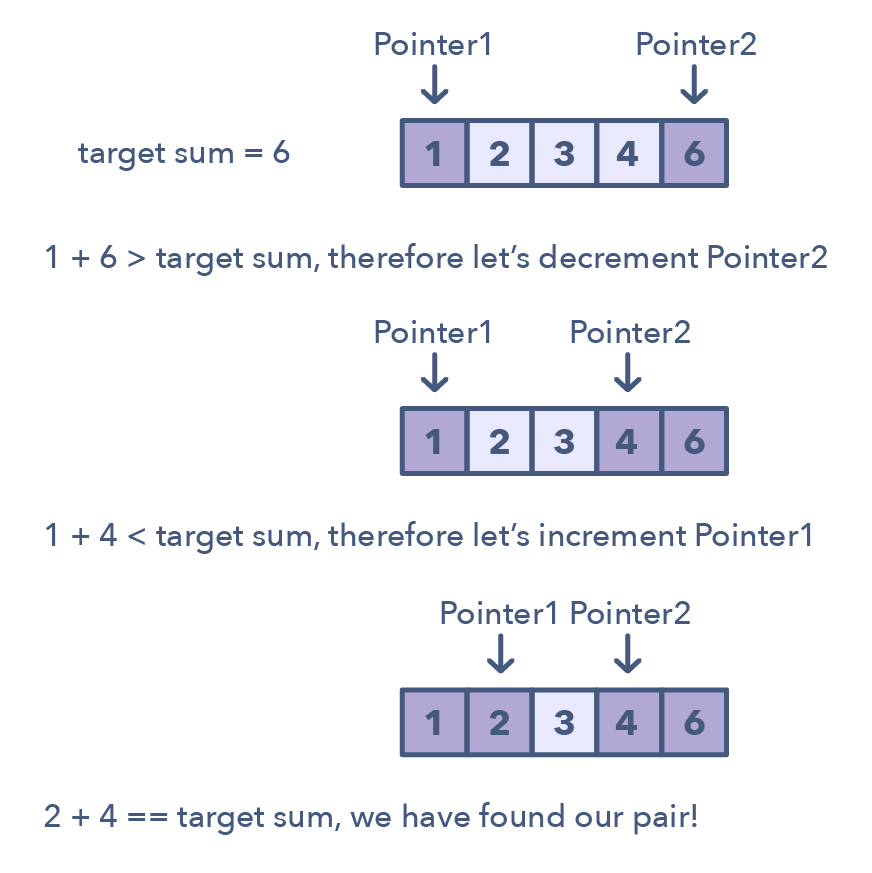

# Two Pointers

## Left and Right Pointer

> A pattern where two pointers iterate through the data structure in tandem until one or both of the pointers hit a certain condition.

### How it works?
With two pointer, you would have to continually loop back through the array to find the answer.

In many cases, two pointers can help you find a solution with better space or runtime complexity.

### When to use?
> **Searching** or **summing** under certain constraints in an Array 、String or Linked-List.
  1. Deal with **sorted** arrays (or Linked Lists) and need to **find a set of elements** that fulfill certain constraints
  2. The set of elements in the array is a **pair**, a **triplet**, or even a **subarray**

### What to resolve?
1. [Reverse String](../../daily/string/reverseString.md)
2. [Reverse Vowels](../../daily/string/reverseVowels.md)
3. [3 Sum](../../blind75/array/3-sum.md)
4. Squaring a sorted array (easy)
5. Triplets that sum to zero (medium)
6. Comparing strings that contain backspaces (medium)
7. [Longest Substring Without Repeating Characters](/blind75//string/longestSubstringWithoutRepeatingCharacters.js)
8. Remove Duplicates from Sorted Array
9. Remove Duplicates from Sorted Array II
10. Two Sum II — Input array is sorted
11. Minimum Size Subarray Sum
12. Squares of a Sorted Array
13. [Valid Palindrome](../blind75/string/valid-palindrome.md)

---

## Fast and Slow Pointer

1. [Remove Duplicates from Sorted Array](../../daily/array/removeDuplicatesFromSortedArray.md)
